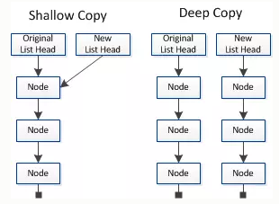

# 浅拷贝与深拷贝
### 浅拷贝与深拷贝的区别
?> 浅拷贝和深拷贝是只针对Object这样的`引用数据类型`的一种操作



!> 浅拷贝只复制某个对象的指针，而不复制对象本身，新旧对象还是共享一块内存，但深拷贝会在堆内存另外创造一个一模一样的对象，新对象和源对象不共享内存，修改训对象不会影响源对象


### 浅拷贝的实现方法
#### 1. Object.assign()
```js
let obj = { a: {a: "kobe", b: 39} };
let initalObj = Object.assign({}, obj);
initalObj.a.a = "wade";
console.log(obj.a.a); //wade  源对象也跟着改变了
```
!> 当被拷贝对象只有一层且都为原始数据类型时，Object.assign()是深拷贝

```js
let obj = {
    username: 'kobe'
    };
let obj2 = Object.assign({},obj);
obj2.username = 'wade';
console.log(obj);//{username: "kobe"}  源对象不受影响
```
#### 2. for循环
```js
function copy (arg) {
  let newObj = Array.isArray(arg) ? [] : {} // 判断入参是否为数组
  for(let item in arg) {
    newobj[item] = arg[item]
  }
  return newobj
}
```
#### 3. ES6扩展运算符 ...
```js
let obj = {
  name: '张三',
  job: '学生'
}
let copyobj = {...obj}
copyobj.name = '李四'
console.log(copyobj)
console.log(obj)
```
#### 针对数组的浅拷贝
**arr.slice(start,end)**
> 返回一个数组中截取出来的元素组成新数组，start指`起始元素`下标，end指`终止元素`下标，当slice()不带任何参数时，默认返回一个原数组一样的新数组
```js
let arr = [1,2,3,4]
let copyArr = arr.slice();
copyArr[0] = 10;
console.log(copyArr); // [10,2,3,4]
console.log(arr); // [1,2,3,4]
```

**arr.concat(arr1,arr2,arrN)**
> 此方法用于连接两个或多个数组(不会改变原数组，返回原数组的副本)
```js
var arr = [1,2,3,4]
var copyArr = arr.concat();
copyArr[0] = 10;
console.log(copyArr); // [10,2,3,4]
console.log(arr); // [1,2,3,4]
```
?> 如果数组的第一级元素是`原始数据类型`,这两个方法类似`深拷贝`

### 深拷贝的实现方法
#### 1. JSON.stringify() & JSON.parse()
用JSON.stringify()把对象转成字符串，再用JSON.parse()把字符串转成新的对象

!> 弊端：会舍弃对象的`constructor`，拷贝之后，不管这个对象原来的构造函数是什么，都会变成`Object`<br>
这种方法只能正确处理可以转成JSON格式的对象，如Array，扁平对象等。不可用：function、undefined、symbol、循环引用的对象

#### 2. 深度遍历
```js
function deepClone (obj) {
  let objClone = Array.isArray(obj) ? [] : {} // 判断入参是否为数组
  if (obj && typeof obj === 'object') {
    for (let key in obj) { // 遍历数组或对象
      if (obj.hasOwnProperty(key)) {
        if (obj[key] && typeof obj[key] === 'object') { // 判断一级元素是否为对象
          objClone[key] = deepClone(obj[key])
        } else {
          objClone[key] = obj[key]
        }
      }
    }
  }
  return objClone
}
```
