# js内存及垃圾回收机制
### 什么是内存？
- 在**软件层面**上，内存通常是操作系统从主存中划分(抽象)出来的内存空间
- 内存可以分为两类：栈内存和堆内存

### 栈内存(Stack memory)
栈是一种常见的数据结构，只允许在结构的一端操作数据，只允许在结构的一端操作数据，

所有的数据都遵循后进先出（last-in first-out)原则

?> 🌰  ：像羽毛球筒，最先放进去的羽毛球只能最后取出，最后放进去的会被最先取出

- 栈内存的容量比较小，主要用于存放**函数调用信息和变量**等数据，大量的内存分配操作会导致栈溢出(Stack overflow)

- 栈内存的数据储存基本都是**临时性**的，数据会在使用完之后立即被回收（如函数内的局部变量在函数返回后就会被回收）

?> 简单来说：栈内存适合存放 _生命周期短，占用空间小_ 且固定的数据

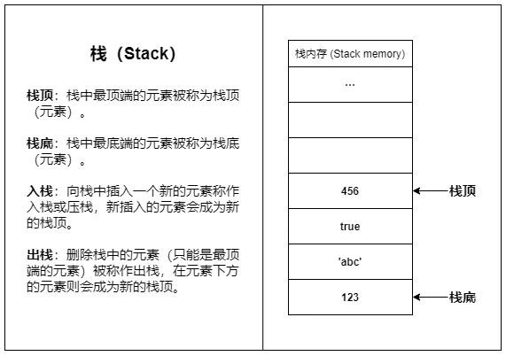

### 堆内存(Heap memory)
- 堆内存是一大片内存空间，堆内存的分配是**动态且不连续**的，程序可以按需申请堆内存空间

- 堆内存里的数据可以长时间存在，无用的数据需要程序**主动回收**，如果大量无用数据占用，会造成**内存泄漏**(memory leak)

?> 堆内存适合存放 _生命周期长_，_占用空间大_ 或者 _占用空间不固定_ 的数据

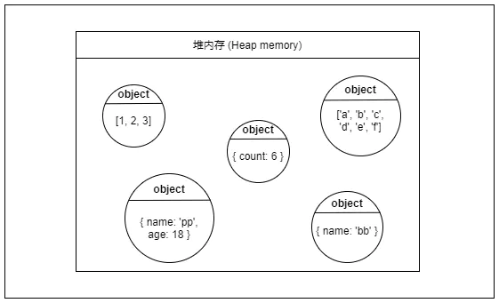

### 函数调用示意
1. 当函数被调用时，会被函数推入栈内存中，生成一个栈帧(Stack frame)，栈帧可以理解为函数的返回地址、参数和局部变量组成的一个块；
2. 当函数调用另一个函数时，也会将另一个函数也推入栈中，周而复始
3. 直到最后一个函数返回，便从栈顶开始将栈内存中的元素逐个弹出，直到栈内存中不再有元素时，此次调用结束

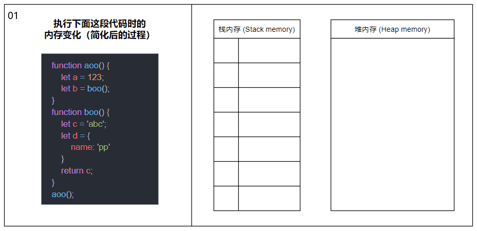

?> 同一线程下 _（js是单线程的）_ ，所有被执行的函数及函数的参数和局部变量都会被推入到同一个栈内存中，这就是大量递归会导致栈溢出的原因

### 储存变量
在多数情况下，原始类型的数据储存在栈内存，引用类型的数据（对象）则储存在堆内存中

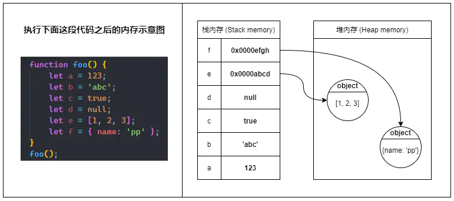

!> `全局变量`以及被`闭包`引用的变量（即使是原始类型）均储存在堆内存中

### 不可变与可变
1. 当我们定义一个原始类型变量，js会在栈内存中激活一块内存来储存变量的值（原始值）
2. 当我们更改原始类型变量时，会再激活一块新的内存来储存新的值，并将变量指向新的内存空间，而不是改变原来那块内存的值
3. 当我们将原始类型变量辅助给另一个新的变量（复制变量）时，也会再激活一块新的内存，并将原变量内存的值复制一份到新的内存里
4. 原始数据类型的比较，会直接对比栈内存中最新的值，只要值相等，连个变量就相等

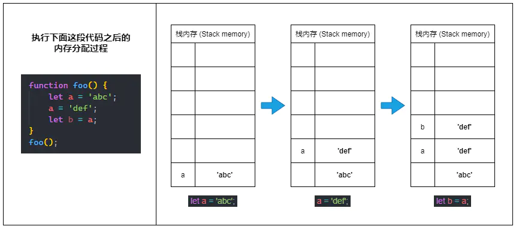

?> 总而言之：栈内存中的原始值一旦确定就不能被更改（不可变）

### 对象的引用
1. 当我们定义一个引用类型的变量时，js会在堆内存中找到一块合适的地方来储存这个对象，并激活一块栈内存来储存对象的堆内存地址，最后将变量指向这块栈内存

?> 所以我们通过变量访问对象的实际访问过程是：变量 => 存在栈内存的引用地址 => 堆内存中的值

2. 当我们把引用类型变量赋值给另一个变量时，实际上只是复制了这个对象的引用地址，并没有在堆内存中生成一份新的对象
3. 当我们给引用类型变量分配一个新的对象时，则会直接改变变量栈内存中的引用，新的引用指向堆内存的新对象
4. 对象的比较，这里涉及到 [浅拷贝与深拷贝](/浅拷贝与深拷贝)

```js
// 两个变量指向的是两个不同的引用
// 虽然这两个对象看起来完全一样
// 但它们确确实实是不同的对象实例
let a = { name: 'pp' }
let b = { name: 'pp' }
console.log(a === b); // false

// 直接赋值的方式复制的是对象的引用
let c = a;
console.log(a === c); // true
```

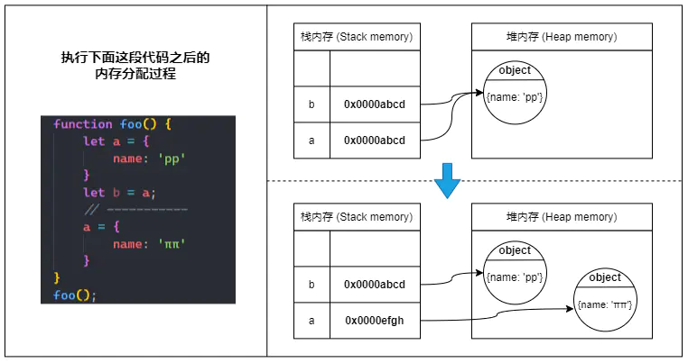

### V8的垃圾回收机制
垃圾回收即我们常说的GC(Garbage collection)，也就是清除内存中不再需要的数据，释放内存空间

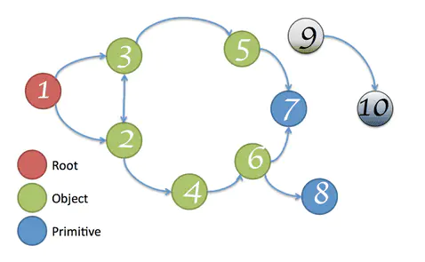

?> **可达性**：在js中，可达性指的是一个变量能否直接或者间接通过`全局对象(window)`访问到，如果可以那么该变量就是可达的,上图中，节点9、10均无法通过根节点直接或间接访问，所以它们都是不可达的，可以被安全回收

#### 堆内存的空间划分
在v8的内存机制中，把**堆内存**(heap memory)划分成多个区域
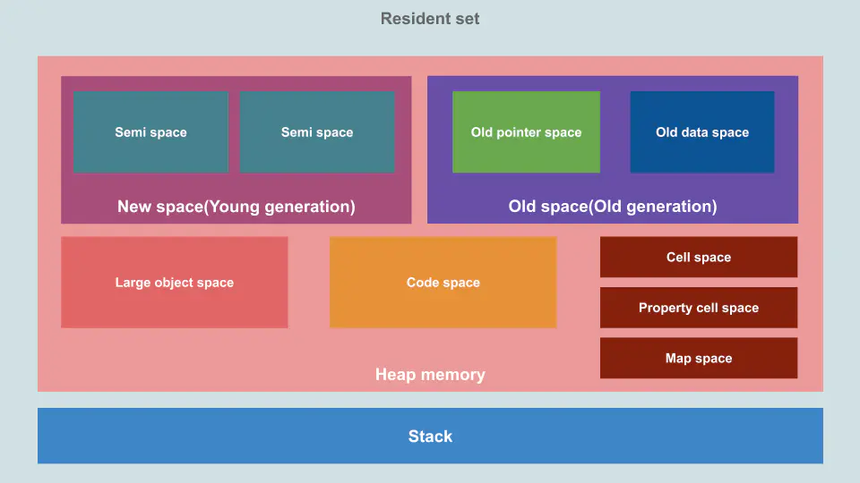
+ `New Space(新空间)`: 又称Young generation(新世代)，用于储存新生成的对象，由`Minor GC`(副GC)进行内存管理
> 64位系统New Space内存大小为`32MB`，32位系统为`16MB` <br>
> 储存在New Space里的新生 对象大多只是`临时使用的`，而且New Space的容量比较小，为了保持内存的可用率，Minor GC会`频繁的运行`，只要New Space里的对象熬过了两次GC，就会晋升到Old Space，变成老油条
+ `Old Space(旧空间)`: 又称Old generation(旧世代)，用于储存那些两次GC仍然存活的对象，由`Major GC`(主GC)进行内存管理
> 64位系统Old Space内存大小为1400MB，32位系统为700MB<br>
> 储存在Old Space里的对象存活时间都比较长，所以Major GC没有那么勤快，这一定程度上降低了性能损耗

#### Minor GC(副GC)
?> 这是一种典型的以空间换时间的垃圾回收算法，基本思路是将内存分为两个大小完全一样的空间`semispace` <br>任一时刻只有一半被使用，处于使用状态的叫做`from`，处于闲置状态的叫做`to`

**工作原理**<br>
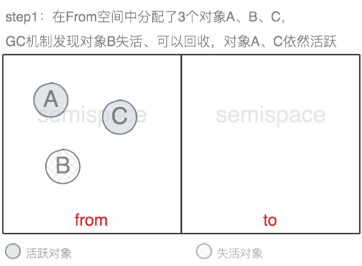<br>
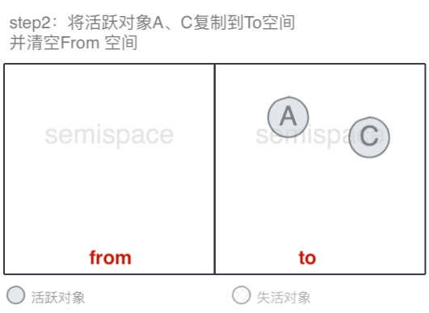<br>

?> 对象从`from空间`复制到`to空间`时，会检查它的内存地址来判断这个对象是否已经经历过一次GC
+ 如果这个对象已经经历过一次GC，那么这个对象会被移动到Old Space中
+ 如果`to空间`内存已经使用了超过`25%`，无论这个对象是第几次经历GC都会直接晋升到Old Space中
+ 设置25%这个阈值的原因是当这次回收完成后，to空间会变为from空间，接下来的内存分配将在这个空间中进行，如果占比过高，会影响后续的内存分配

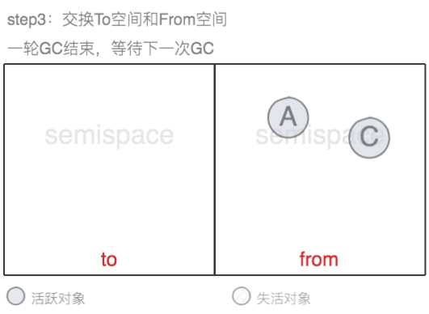<br>

?> 通过上面的流程图，我们可以很清楚的看到，from和to交换就是为了让活跃对象始终保持在一块semispace中，另一块semispace始终保持空闲状态，在New Space中活跃对象只占少部分，所以只复制活跃对象在时间效率上有优异的表现，缺点是只能使用New Space的一半，这是由划分空间和内存机制所决定的。

#### Major GC(主GC)
V8引擎在Old Space中主要采用了Mark-Sweep和Mark-Compact相结合的方式进行垃圾回收
##### 三色标记(mark)📌
V8在标记📌上使用的是一种三色 marking（tricolor marking）的算法，`白色`代表这个对象可以被回收；`黑色`代表这个对象不能回收，而且它产生的所有引用都已经扫描完毕；`灰色`代表这个对象不能被回收，但它产生的引用还没有被扫描完。

> 当老生代GC启动的时候，V8 会扫描老生代的对象，沿着引用做标记（mark）
> 1. 最开始的时候所有的`非根对象`带有的标记都是`白色`的，接着 V8 将根对象直接引用的对象放进一个`显式的栈`，并标记它们为`灰色`。
> 2. 接下来，V8 从这些对象开始做深度优先搜索，每访问一个对象，就将它 pop 出来，标记为黑色，然后将它引用的所有白色对象标记为灰色，push 到栈上，如此循环往复，直到栈上的所有对象都 pop 掉了为止。
> 3. 最后老生代的对象就只有黑色（不可回收）和白色（可以回收）两种。
标记完死亡对象（白色）之后，V8 就可以回收这些死亡对象占用的内存了。回收的方法有两种：sweeping 或者 compacting。
##### Sweeping
Sweeping 就是扫描所有被标记的对象，找到死亡对象占用的连续区块，将这些区块添加到随该页维护的一个 `freelist` 里。这个数据结构保存了页上可用于下次分配的内存位置，可以用于 compacting、新生代晋升与老生代直接分配对象等需要在老生代中分配内存的场景。V8 中按照可用内存块大小的区间分出了多个 freelist，这样能更快找到合适的可用内存。

!> 缺点：Sweep在进行一次清除后，内存空间会出现很多`内存碎片`，这种内存碎片会对后续的内存分配造成问题，如果出现需要分配一个大内存的情况，由于剩余的碎片空间不足以完成此次分配，会提前触发`垃圾回收`，这次垃圾回收是不必要的

##### Compacting
Compacting 则是将内存中所有活跃对象都转移到Old Space的一端，这样存活对象都被移走了的区块内存就可以直接清空了。这种方法主要发生在某一页中死亡对象留下来的`空洞（hole）`比较多的时候，但也会有例外，比如这一页中的对象被太多其他页的对象引用的时候就不会 compact，不然移动对象后更新所有指过来的指针将会是不小的开销。

##### 两者结合
在V8的回收策略中，Mark-Sweep和Mark-Compact两者是`结合使用`的，由于Mark-Compact需要移动对象，所以它的执行速度不可能很快，在取舍上，V8主要使用Mark-Sweep进行GC，在`空间不足`以分配从新生代中晋升过来的对象时，才使用Mark-Compact

#### V8的优化策略

1. **Incremental Marking（增量标记）**
> 由于全停顿会造成了浏览器一段时间无响应，所以V8使用了一种增量标记的方式，将完整的标记拆分成很多部分，每做完一部分就停下来，让JS的应用逻辑执行一会，这样垃圾回收与应用逻辑交替完成。经过增量标记的改进后，垃圾回收的最大停顿时间可以减少到原来的1/6左右
2. **惰性清理**
> 由于标记完成后，所有的对象都已经被标记，不是死对象就是活对象，堆上多少空间格局已经确定。我们可以不必着急释放那些死对象所占用的空间，而延迟清理过程的执行。垃圾回收器可以根据需要逐一清理死对象所占用的内存页
3. **其他**
> V8后续还引入了增量式整理（incremental compaction），以及并行标记和并行清理，通过并行利用多核CPU来提升垃圾回收的性能
