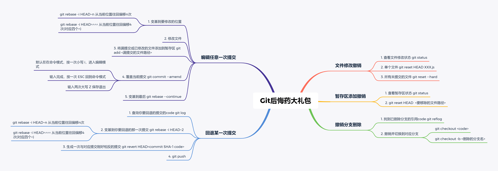

### git branch
#### 查看所有分支
```git
git branch -a
```
#### 创建本地分支
```git
git branch branchName
```

#### 本地分支重命名
```git
git branch -m newName
```

#### 删除本地分支
```git
git branch -d branchName
-D 强制删除
```

#### 删除远程分支
```git
git push -d origin branchName
// 显示如下，说明删除成功
// To http://11.11.11.11/demo/demo.git
// - [deleted]           branchName
```

#### 推送本地分支到远程
```git
git push origin branchName
```

#### 本地分支关联远程分支
```git
git branch --set-upstream-to=origin/branchName
```

### [git cherry-pick](http://www.ruanyifeng.com/blog/2020/04/git-cherry-pick.html)
```git
git cherry-pick <commitHash>/branchName
// 将此条提交应用于当前分支
```

### git checkout
#### 切换到目标分支
```git
git checkout branchName
```
#### 新建分支并切换到该分支
```git
git checkout -b newBranchName
```

### git rebase
```git
git rebase branchName
// 将当前分支的新提交 变基到目标分支
```


### git stash/git stash pop
```git
git stash   // 将当前修改暂存在本地，不提交
git stash pop  // 还原成暂存前的状态
```

### [git 后悔药大全](https://juejin.cn/post/6948338652845965348)

