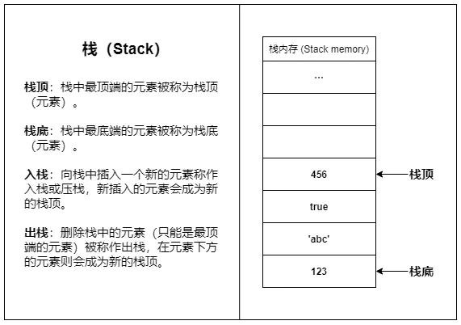
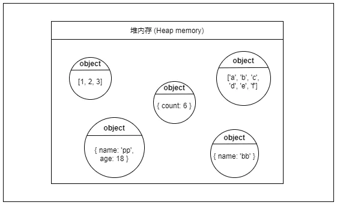
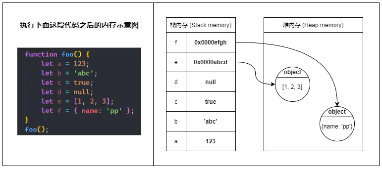
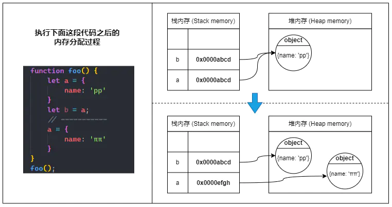
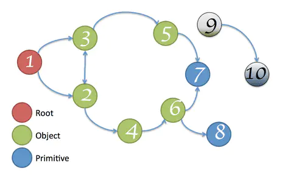

# js内存及垃圾回收机制
### 什么是内存？
- 在**软件层面**上，内存通常是操作系统从主存中划分(抽象)出来的内存空间
- 内存可以分为两类：栈内存和堆内存

### 栈内存(Stack memory)
栈是一种常见的数据结构，只允许在结构的一端操作数据，只允许在结构的一端操作数据，

所有的数据都遵循后进先出（last-in first-out)原则

?> 🌰  ：像羽毛球筒，最先放进去的羽毛球只能最后取出，最后放进去的会被最先取出

- 栈内存的容量比较小，主要用于存放**函数调用信息和变量**等数据，大量的内存分配操作会导致栈溢出(Stack overflow)

- 栈内存的数据储存基本都是**临时性**的，数据会在使用完之后立即被回收（如函数内的局部变量在函数返回后就会被回收）

?> 简单来说：栈内存适合存放 _生命周期短，占用空间小_ 且固定的数据



### 堆内存(Heap memory)
- 堆内存是一大片内存空间，堆内存的分配是**动态且不连续**的，程序可以按需申请堆内存空间

- 堆内存里的数据可以长时间存在，无用的数据需要程序**主动回收**，如果大量无用数据占用，会造成**内存泄漏**(memory leak)

?> 堆内存适合存放 _生命周期长_，_占用空间大_ 或者 _占用空间不固定_ 的数据



### 函数调用示意
1. 当函数被调用时，会被函数推入栈内存中，生成一个栈帧(Stack frame)，栈帧可以理解为函数的返回地址、参数和局部变量组成的一个块；
2. 当函数调用另一个函数时，也会将另一个函数也推入栈中，周而复始
3. 直到最后一个函数返回，便从栈顶开始将栈内存中的元素逐个弹出，直到栈内存中不再有元素时，此次调用结束


?> 同一线程下 _（js是单线程的）_ ，所有被执行的函数及函数的参数和局部变量都会被推入到同一个栈内存中，这就是大量递归会导致栈溢出的原因

### 储存变量
在多数情况下，原始类型的数据储存在栈内存，引用类型的数据（对象）则储存在堆内存中



!> `全局变量`以及被`闭包`引用的变量（即使是原始类型）均储存在堆内存中

### 不可变与可变
1. 当我们定义一个原始类型变量，js会在栈内存中激活一块内存来储存变量的值（原始值）
2. 当我们更改原始类型变量时，会再激活一块新的内存来储存新的值，并将变量指向新的内存空间，而不是改变原来那块内存的值
3. 当我们将原始类型变量辅助给另一个新的变量（复制变量）时，也会再激活一块新的内存，并将原变量内存的值复制一份到新的内存里
4. 原始数据类型的比较，会直接对比栈内存中最新的值，只要值相等，连个变量就相等


?> 总而言之：栈内存中的原始值一旦确定就不能被更改（不可变）

### 对象的引用
1. 当我们定义一个引用类型的变量时，js会在堆内存中找到一块合适的地方来储存这个对象，并激活一块栈内存来储存对象的堆内存地址，最后将变量指向这块栈内存

?> 所以我们通过变量访问对象的实际访问过程是：变量 => 存在栈内存的引用地址 => 堆内存中的值

2. 当我们把引用类型变量赋值给另一个变量时，实际上只是复制了这个对象的引用地址，并没有在堆内存中生成一份新的对象
3. 当我们给引用类型变量分配一个新的对象时，则会直接改变变量栈内存中的引用，新的引用指向堆内存的新对象
4. 对象的比较，这里涉及到 [浅拷贝与深拷贝](../js/浅拷贝与深拷贝)

```js
// 两个变量指向的是两个不同的引用
// 虽然这两个对象看起来完全一样
// 但它们确确实实是不同的对象实例
let a = { name: 'pp' }
let b = { name: 'pp' }
console.log(a === b); // false

// 直接赋值的方式复制的是对象的引用
let c = a;
console.log(a === c); // true
```



### 垃圾回收机制
垃圾回收即我们常说的GC(Garbage collection)，也就是清除内存中不再需要的数据，释放内存空间



?> **可达性**：在js中，可达性指的是一个变量能否直接或者间接通过`全局对象(window)`访问到，如果可以那么该变量就是可达的,上图中，节点9、10均无法通过根节点直接或间接访问，所以它们都是不可达的，可以被安全回收
