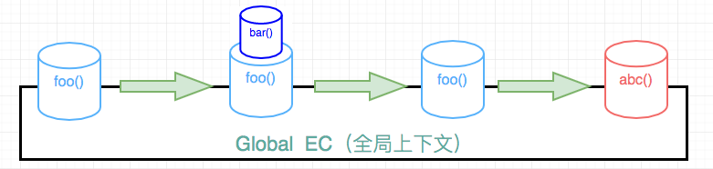
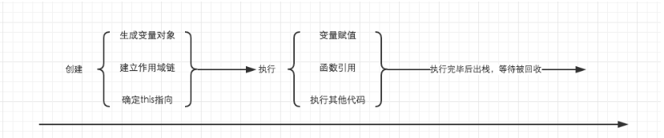
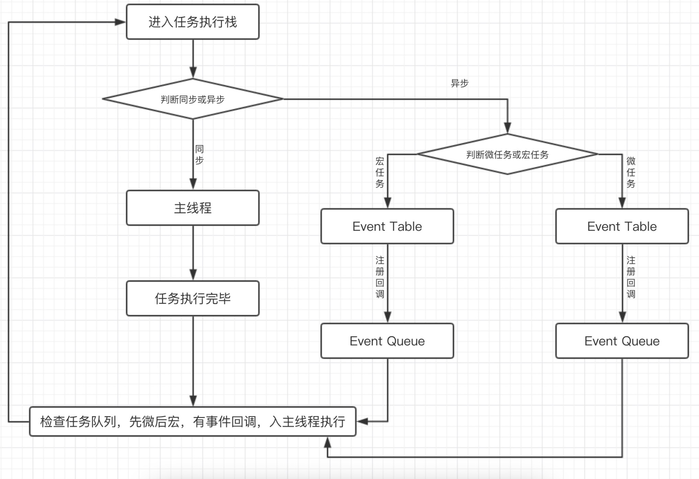

### 执行栈
JS代码在`运行前`都会创建`执行上下文`，也可以理解为执行环境，JS中有三种执行上下文：<br>
* `全局执行上下文`：默认的，在浏览器中是Windows对象
* `函数执行上下文`：JS的函数每当被调用时都会创建一个上下文
* `Eval执行上下文`：eval函数会产生自己的上下文

#### 执行上下文的特点
1. 单线程，在主进程上运行
2. 同步执行，从上往下按顺序执行
3. 全局执行上下文只有一个，浏览器关闭时会被弹出栈
4. 函数的执行上下文没有数量限制
5. 函数每调用一次，都会产生一个新的执行上下文

[栈](/拓展知识/js内存机制?id=栈内存stack-memory)是一种数据结构，遵循先进后出的原则。当引擎`第一次`遇到JS代码时，会产生一个`全局执行上下文`并压入执行栈，每遇到一个函数调用，就会往栈中压入一个新的上下文，引擎会从栈顶开始执行，当函数调用完成时，这个上下文环境以及其中的数据都会被消除，再重新回到全局上下文环境。

!> 处于运行状态的执行上下文只能且只有一个


```js
function foo(){
  console.log('1')
  bar()
  console.log('3')
}
function bar(){
  console.log('2')
}
function abc(){
  console.log('4')
}
foo()
abc()
```
执行流程如下：



?> 首先执行这个JS文件，创建一个全局上下文，并压入执行栈中，当foo函数被调用时，将foo的上下文压入执行栈，接着执行输出'1'；当bar函数被调用麻将bar函数的执行上下文压入栈中，接着执行输出2，bar函数执行完毕，弹出bar函数的执行上下文，接着打印3，foo函数执行完毕，弹出foo执行上下文，接下来开始执行abc函数，把abc的执行上下文压入栈，打印4，接着弹出abc上下文，打印顺序为1，2，3，4

!> `个人理解`：所谓的先进后出，是指在某个执行上下文中，函数的调用遵循先进后出规则，全局执行上下文可以看成最大，最下层的上下文，所有的函数调用都是在全局上下文的基础上执行的

#### 执行上下文生命周期


### JavaScript事件循环
* 任务进入执行栈，主线程执行同步任务，当在这个同步任务中遇到异步任务，将异步任务放在`Event Table`并注册函数
* 当前同步任务执行完毕时，`Event Table`会此前存的异步任务移入`Event Queue(任务队列)`等待执行（`微任务`放在微任务队列，`宏任务`放在宏任务队列）
* 当执行栈被清空后，检查任务队列，先处理微任务队列中的task
* 微任务队列清空后，进入宏任务队列，取队列中第一项宏任务放入执行栈中执行，回到第一步



#### macro-task(宏任务)

可以理解是每次执行栈执行的代码就是一个宏任务(包括每次从事件队列中获取一个事件回调并放到执行栈中执行)。
macro-task主要包含：`script(整体代码)`、`setTimeout`、`setInterval`、`I/O(文件读写）`、`UI交互事件`、`postMessage`、`MessageChannel`、`setImmediate(Node.js环境)`

#### micro-task(微任务)

micro-task 主要包含：`Promise.then`、`MutaionObserver`、`process.nextTick(Node.js 环境)`

#### 示例
```js
async function async1() {
  console.log('async1 start') // 2同步任务输出async1 start
  await async2() // 入栈
  console.log('async1 end') // 先放入微任务队列   6输出async1 end
}

async function async2() {
  console.log('async2') // 3输出async2
}

console.log('script start') // 1同步任务输出script start

setTimeout(function() {
  console.log('setTimeout') // 先放入宏任务队列  8输出setTimeout
}, 0)

async1() // 入栈

new Promise(function(resolve) {
  console.log('promise1') // 4同步任务输出promise1
  resolve()
}).then(function() {
  console.log('promise2') // 先放入微任务队列   7输出promise2
})

console.log('script end') // 5同步任务输出script end
```
